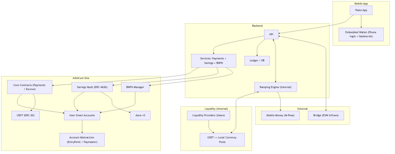
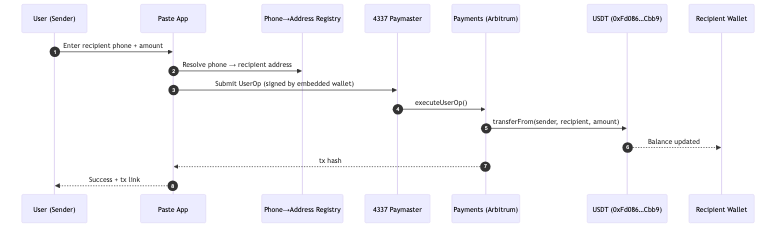
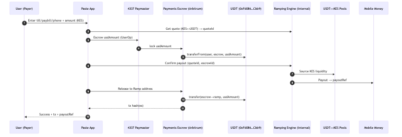
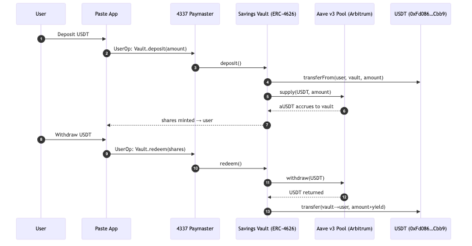
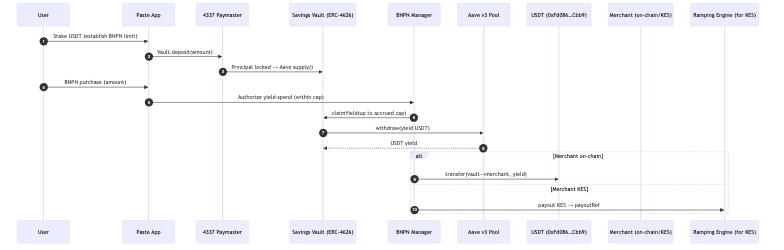

# Paste Finance — System Architecture and Money Flows

Network: Arbitrum One (chainId 42161)

## System Architecture

---

## P2P Payment (phone → phone, on-chain)

- Custody & ownership:
  - Sender smart account → after USDT transfer settles → Recipient smart account owns funds.
- Chain & contracts (Arbitrum One, 42161):
  - USDT: `0xFd086bC7CD5C481DCC9C85ebE478A1C0b69FCbb9`
  - 4337 EntryPoint v0.6: `0x5FF137D4b0FDCD49DcA30c7CF57E578a026d2789`
  - Paste Payments: `TBA`
- Reconciliation artifacts:
  - On-chain: tx hash (Arbiscan), Transfer event
  - Off-chain: ledger debit/credit, phone→address resolution snapshot

---

## Merchant Payment (on-chain → M-Pesa)

- Custody & ownership:
  - User smart account → On-chain escrow → Ramping Engine → Merchant’s M-Pesa account (KES).
- Chain & contracts (Arbitrum One, 42161):
  - USDT: `0xFd086bC7CD5C481DCC9C85ebE478A1C0b69FCbb9`
  - Payments Escrow: `TBA`
  - 4337 EntryPoint v0.6: `0x5FF137D4b0FDCD49DcA30c7CF57E578a026d2789`
- Reconciliation artifacts:
  - On-chain: escrow lock tx hash; escrow release tx hash
  - Off-chain: `quoteId`, `payoutRef` (M-Pesa), `orderId` (ramp), ledger entries linking `escrowId ↔ payoutRef`

---

## Savings / Yield (Aave v3 on Arbitrum)

- Custody & ownership:
  - User smart account → Vault → Aave (via vault) → back to user on redeem.
- Chain & contracts (Arbitrum One, 42161):
  - USDT: `0xFd086bC7CD5C481DCC9C85ebE478A1C0b69FCbb9`
  - Savings Vault (ERC-4626): `TBA`
  - Aave v3 Pool (Arbitrum market): canonical per Aave docs
  - 4337 EntryPoint v0.6: `0x5FF137D4b0FDCD49DcA30c7CF57E578a026d2789`
- Reconciliation artifacts:
  - On-chain: deposit/withdraw tx hashes; Vault share mint/burn; Aave supply/withdraw logs
  - Off-chain: position snapshots, share balance, APY source, ledger entries

---

## BNPN Purchase (spend yield, not principal)

- Custody & ownership:
  - Principal: User → Vault → Aave (remains user-owned).
  - Yield: Vault → BNPN Manager → Merchant (on-chain) or Ramp payout (KES).
- Chain & contracts (Arbitrum One, 42161):
  - USDT: `0xFd086bC7CD5C481DCC9C85ebE478A1C0b69FCbb9`
  - Savings Vault (ERC-4626): `TBA`
  - BNPN Manager: `TBA`
  - Aave v3 Pool (Arbitrum market)
  - 4337 EntryPoint v0.6: `0x5FF137D4b0FDCD49DcA30c7CF57E578a026d2789`
- Reconciliation artifacts:
  - On-chain: yield-claim tx hash; merchant settlement tx hash (if on-chain)
  - Off-chain: BNPN `agreementId` (principal, cap, term), `invoiceId`, `payoutRef` (if KES), ledger entries 